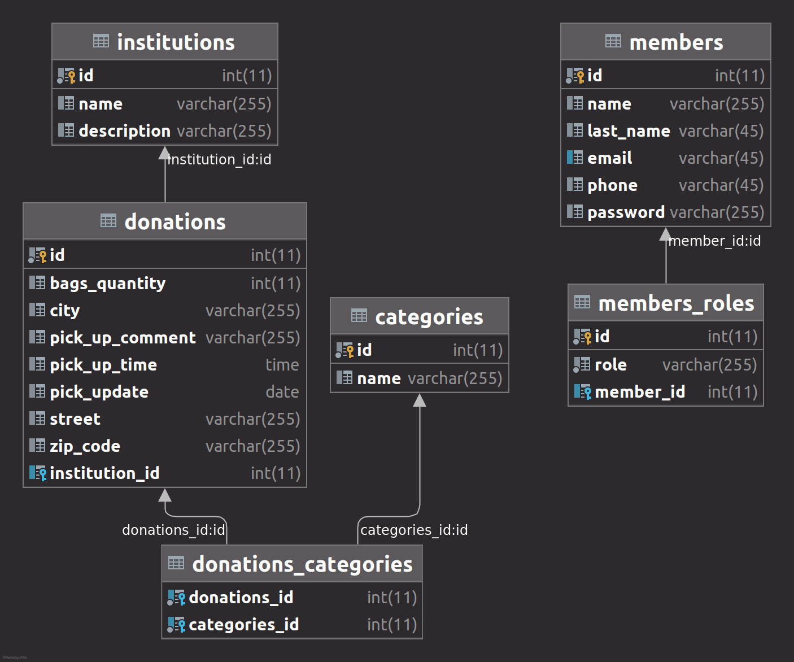

#Charity_Donations_Collector

This project consists of two 2 parts:
1. One-page website, which is divided into sections such as about, list of foundations and a contact form.
2. A webapp for **foundations**, which allows the `collection of donations` such as clothes, toys, books and others.

The app allows `user authentication`, because only registered users can make donations. Is possible to keep registering 
users with an email and password that have not been previously registered.

###Functionalities and characteristics:
- Relational database in MySQL
- Validation of registration and login forms
- `Passay` for password's strength validation during registration
- Double validation for **donations form**, front end with `JavaScript` and back end with `Java`
- `Inputs summary` at the end of the donations form before confirmation
- `Error messages` for inputs read from `message.properties`
- **Donation confirmation by email** after correctly filling out the donation form

###Database diagram:

###Technologies and tools:
The app was developed using: `SpringBoot, SpringSecurity, Spring Email, Lombok, Passay, Thymeleaf, MySQL, JavaScript, HTML5 and CSS.
